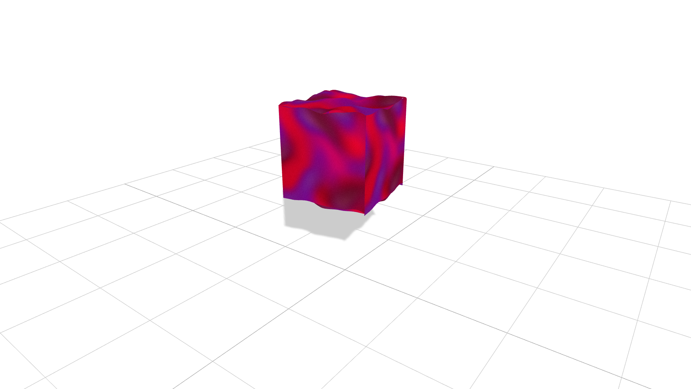

# Gradient Cube

**A vibrant WebGL shader experiment** built using **Three.js** and **GLSL**, showcasing a dynamically deformed cube with animated gradient layers and soft real-time shadows. Featuring procedural noise-based vertex displacement, interactive **lil-gui** controls for customizing gradients, colors, and grain intensity, and a responsive full-screen canvas — all wrapped in a clean, modern interface with smooth time-based transitions.


[](https://gradient-cube.vercel.app/)

---

## ✨ Features

* 🌈 **Gradient-Driven Shader** blending multiple animated colors using smooth noise functions and time-based UV distortion
* 💡 **Dynamic Lighting & Shadows** with real-time **Three.js** directional lighting and custom shadow deformation using `customDepthMaterial`
* 🌀 **Procedural Vertex Deformation** powered by GLSL noise and animated with `uTime` for subtle, organic movement
* 🎛️ **Interactive Controls** via **lil-gui** to tweak gradient strength, grain, deformation, and colors in real time
* 🌾 **Procedural Grain Layer** adds filmic texture for a soft, analog feel
* 🖥️ **Responsive Canvas** using full-viewport rendering and pixel ratio clamping for crisp visuals across devices
* 🧱 **High-Resolution Geometry** with 32x32x32 subdivisions for smooth surface warping and shader detail
* 🎨 **Modular GLSL Shaders** separated into `vertex.glsl` and `fragment.glsl` for easy editing and reuse
* ⚡ **Optimized Render Loop** with smooth animation, minimal overhead, and instant shader load masking via a styled loader

---

## 🧠 How It Works

* Renders a **subdivided cube mesh** using a custom `ShaderMaterial` with vertex and fragment GLSL shaders
* Applies **vertex displacement** via procedural noise in the vertex shader, animated with a `uTime` uniform
* Projects dynamic **real-time shadows** using a `customDepthMaterial` that mirrors the vertex deformation
* Generates smooth, **animated gradients** in the fragment shader by layering time-distorted noise patterns
* Blends multiple **color channels** (`uColorA` to `uColorD`) based on animated noise and a tunable `uGradient` uniform
* Adds **procedural grain** for a subtle texture overlay, calculated per-frame for an analog film-like effect
* Leverages **Three.js lighting**, including ambient and directional light with shadow casting and soft shadows
* Integrates **lil-gui** for real-time interaction with gradient intensity, color values, deformation, and grain amount
* Maintains a **responsive layout** with full-screen canvas, pixel ratio clamping, and auto-resizing logic

---

## 🛠️ Built With

* [Three.js](https://threejs.org/) – Core 3D engine for scene setup, camera, lighting, shadows, and geometry
* [GLSL](https://thebookofshaders.com/) – Custom vertex and fragment shaders for gradient blending, deformation, and grain
* [TailwindCSS](https://tailwindcss.com/) – Utility-first CSS framework for clean, responsive UI and layout styling
* [lil-gui](https://lil-gui.georgealways.com/) – Lightweight interface for real-time control of shader parameters
* [ShaderMaterial](https://threejs.org/docs/#api/en/materials/ShaderMaterial) – Enables custom GLSL integration for full visual control
* [BoxGeometry](https://threejs.org/docs/#api/en/geometries/BoxGeometry) – High-resolution cube mesh with dense subdivisions for smooth deformation
* [PerspectiveCamera](https://threejs.org/docs/#api/en/cameras/PerspectiveCamera) – Realistic 3D projection with depth perspective
* [MeshDepthMaterial](https://threejs.org/docs/#api/en/materials/MeshDepthMaterial) – Customized for shadow deformation to match vertex displacement

---

## Clone the repo

```bash
git clone https://github.com/its-riki-dev/gradient-cube.git

# Install dependencies
npm install

# Start the development server
npm run dev

# Build for production
npm run build

# Preview production build
npm run preview
```

---

## 📄 License

- This project is licensed under the MIT License.
